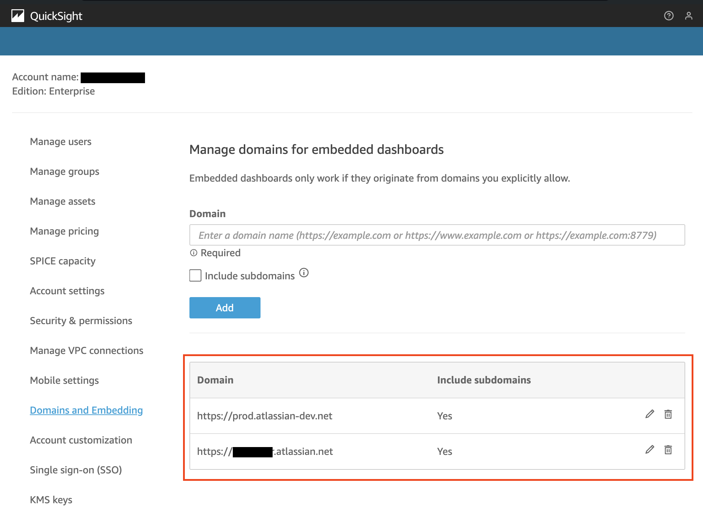
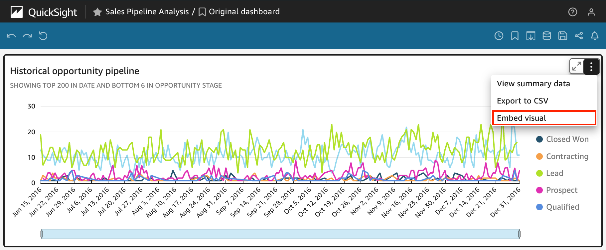
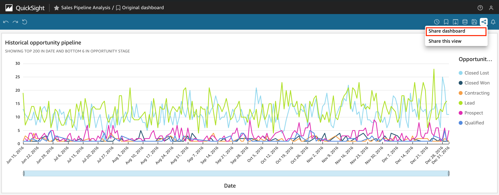
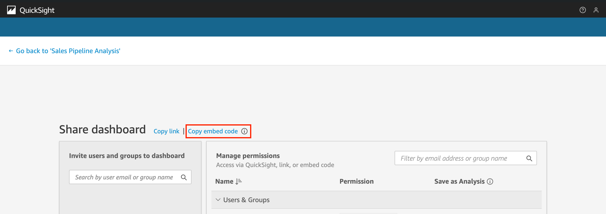
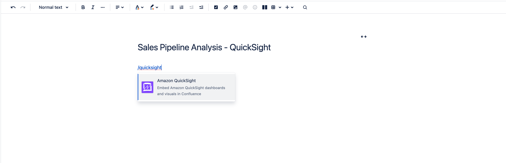
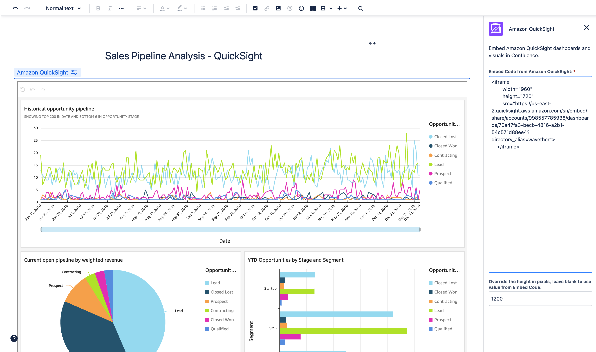

The following is intended to be a quick start for those familiar with managing Amazon QuickSight and are looking to quickly deploy Amazon QuickSight Connector for Confluence.

## In this guide we'll do the following

1. Install the app
1. Configure Amazon QuickSight to allow embedding visuals from Atlassian products
1. Test embedding an Amazon QuickSight visual in a Confluence page
1. Frequently Asked Questions (FAQs)

## Prerequisites

1. You'll need Confluence Admin permission to install the app
1. You'll need administrative permission to manage the allowed domain list for embedding dashboards and visuals on Amazon QuickSight.
1. An active Confluence Cloud space in which you can create pages

## Step 1. Installation

1. Install [Amazon QuickSight Connector for Confluence](https://marketplace.atlassian.com/1234924?utm=wavether_site) on the Atlassian Marketplace on your desired Confluence instance.
1. Once installed, you can find Amazon QuickSight Connector for Confluence in the top-level **Apps** menu, under **Manage apps**.
1. The app does not require any admin configurations.

## Step 2. Configure Amazon QuickSight to allow embedding visuals from Atlassian products

In order to embed visuals from QuickSight on your Atlassian Cloud instance, you have to add the Atlassian Cloud domains to the **Allow listing static domain** through the QuickSight console. Please following the instructions on [Amazon QuickSight User Guide, Allow listing static domains](https://docs.aws.amazon.com/quicksight/latest/user/embedding-static.html) and add the following Atlassian domains, including subdomains:

- https://[your-subdomain].atlassian.net
- https://prod.atlassian-dev.net

!!! information

    The Amazon QuickSight Connector app is built with [Atlassian Forge](https://developer.atlassian.com/platform/forge/) technology. The app is served by Atlassian from a subdomain under `http://prod.atlassian-dev.net` that is both random and unique. Therefore, the `https://prod.atlassian-dev.net` domain and it's subdomains need be added to the QuickSight allow list to such that the [Content Security Policy (CSP)](https://developer.mozilla.org/en-US/docs/Web/HTTP/CSP) as set by Amazon QuickSight will allow the embed code to function.

The configured settings should be similar as shown below:

## Step 3. Test embedding an Amazon QuickSight visual in a Confluence page

The app does not require any global or space level configuration. You can start embedding QuickSight visuals once you've finished the above steps. Let's give it a try.

!!! information

    You can embed both dashboards and visuals. See [Amazon QuickSight User Guide](https://docs.aws.amazon.com/quicksight/latest/user/embedded-analytics-1-click.html#embedded-analytics-1-click-code) for more details on embedding visuals and dashboards.

1. Get the embed code from Quick Sight.

   For visuals, click `Embed Visual`:

   

   For dashboards, first click `Share dashboard`:

   

   Then click `Copy embed code`:

   

1. Create a new Confluence page or start editing a page. Type `/quicksight` into the page editor and Confluence should prompt you with the **Amazon QuickSight** macro, select to proceed:

   

1. Hover over the inserted and click edit to bring up the config panel for the marco, where you can enter the embed code from QuickSight and choose the alignment of the visual.

   

## Frequently Asked Questions (FAQs)

### FAQ-1. Why I cannot see the embedded visuals?

There are a few possible reasons:

1. The Atlassian Cloud domains are not added to the QuickSight, Domain and Embedding, including subdomains. See above steps to ensure they are added.
2. Your internet browser's "block all cookies" settings is turned on. QuickSight [requires](https://docs.aws.amazon.com/quicksight/latest/user/embedded-analytics-1-click.html#embedded-analytics-1-click-prerequisites) this setting to be turned off in your browser.
3. You are not logged into Amazon QuickSight and your dashboard is only shared with registered users. Please log in as a registered user of QuickSight and try again.
4. Your dashboard is not shared public for viewing without logging into QuickSight. Please review [Amazon QuickSight User Guide, Turning on public access to visuals and dashboards with a 1-click embed code](https://docs.aws.amazon.com/quicksight/latest/user/embedded-analytics-1-click-public.html) for instructions if you want to allow public access to the visuals.

## References

- [Embedding visuals and dashboards for registered users with a 1-click embed code](https://docs.aws.amazon.com/quicksight/latest/user/embedded-analytics-1-click.html), Amazon QuickSight User Guide
- [Turning on public access to visuals and dashboards with a 1-click embed code](https://docs.aws.amazon.com/quicksight/latest/user/embedded-analytics-1-click-public.html), Amazon QuickSight User Guide
