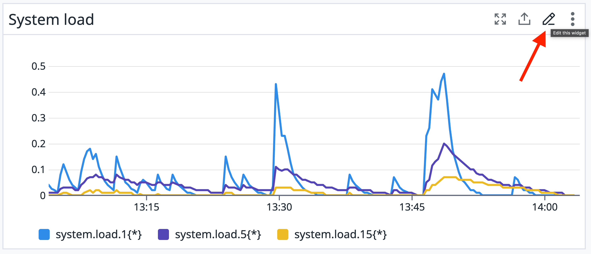
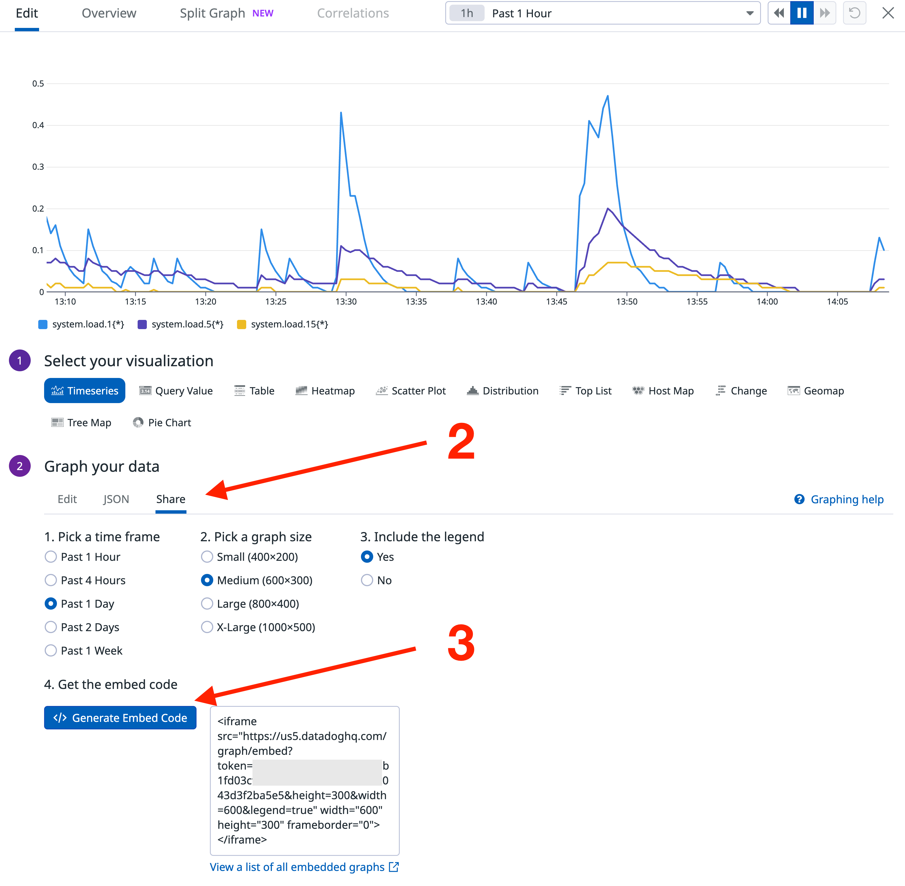
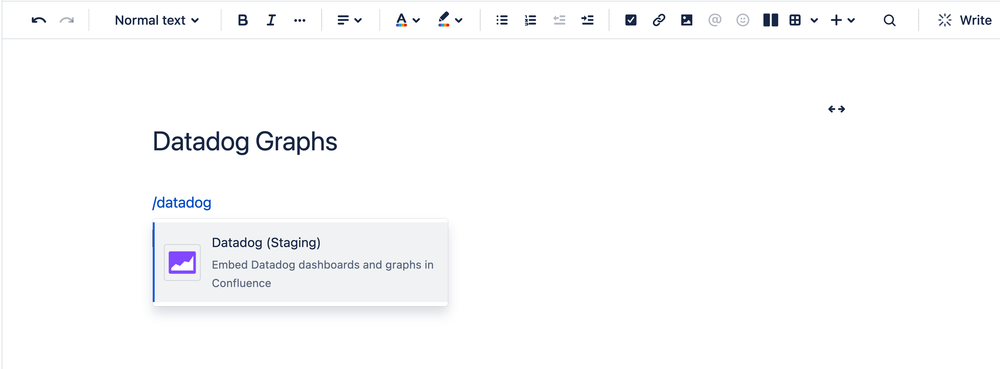
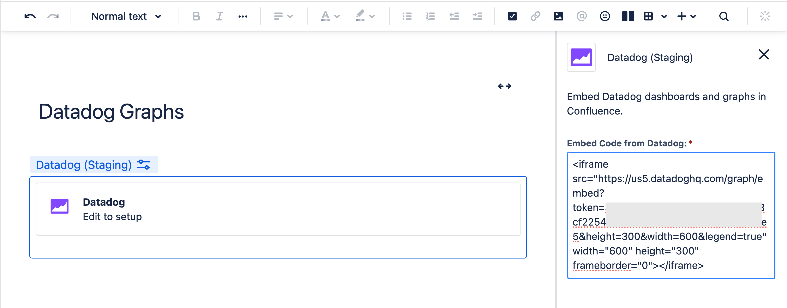
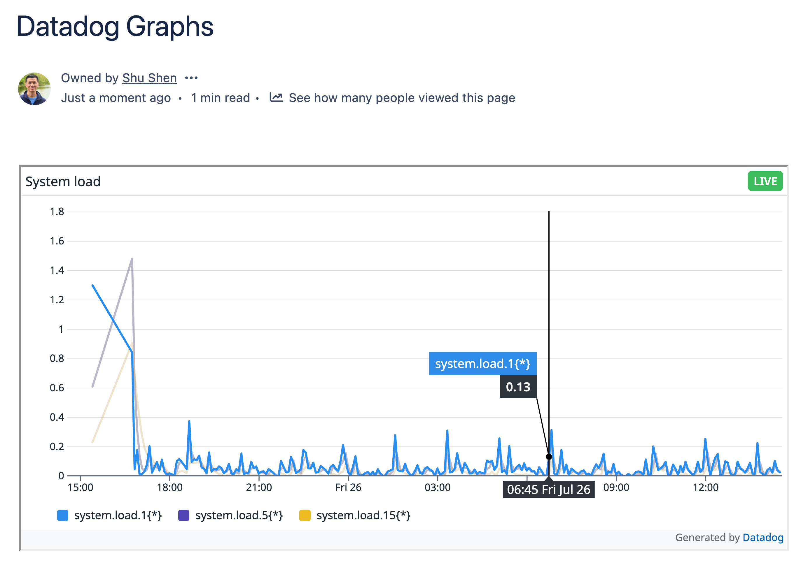

The following is intended to be a quick start for those familiar with managing Datadog and are looking to quickly deploy Datadog Connector for Confluence.

## In this guide we'll do the following

1. Install the app
1. Test embedding a live Datadog graph in a Confluence page

## Prerequisites

1. You'll need Confluence Admin permission to install the app
1. You'll need the `dashboards_public_share` permission on Datadog to generate the embed code for the graphs.
1. An active Confluence Cloud space in which you can create pages

## Step 1. Installation

1. Install [Datadog Connector for Confluence](https://marketplace.atlassian.com/FIXME?utm=wavether_site) on the Atlassian Marketplace on your desired Confluence instance.
1. Once installed, you can find Datadog Connector for Confluence in the top-level **Apps** menu, under **Manage apps**.
1. The app does not require any admin configurations.

## Step 2. Test embedding a Datadog graph in a Confluence page

The app does not require any global or space level configuration. You can start embedding Datadog graphs once you've finished the above steps. Let's give it a try.

!!! information

    See [Datadog Documentation](https://docs.datadoghq.com/dashboards/sharing/graphs/) for more details on sharing graphs.

1. From the graph you want to share, click the pencil icon in the upper right corner.
   
2. Under the `Graph your data` section, select the `Share` tab (see screenshot below).
3. Get the embed code with the `Generate embed code` button.

   

4. Create a new Confluence page or start editing a page. Type `/datadog` into the page editor and Confluence should prompt you with the **Datadog** macro, select to proceed:

   

5. Hover over the inserted and click edit to bring up the config panel for the marco, where you can enter the embed code from Datadog. That's it! Close the config panel and enjoy your Datadog graph in Confluence!

   

6. That's it! Close the config panel, publish the page, lay back and enjoy your live Datadog graph in Confluence!

   

## References

- [Share Graphs](https://docs.datadoghq.com/dashboards/sharing/graphs/), Datadog Docs
